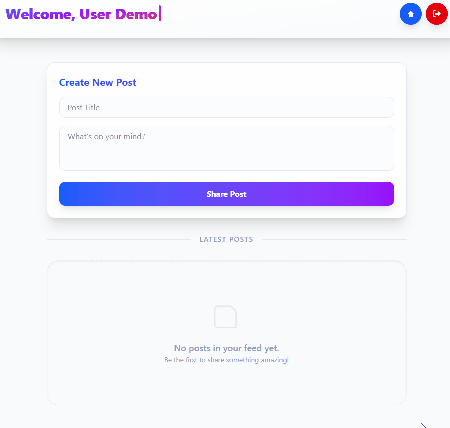
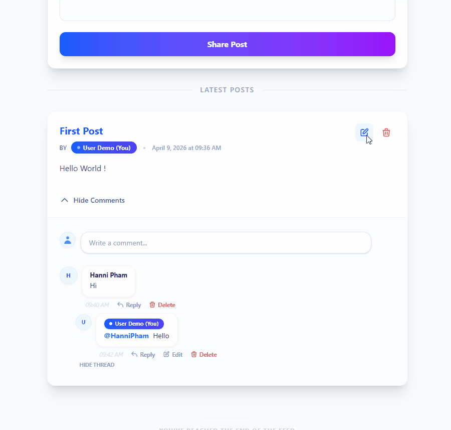
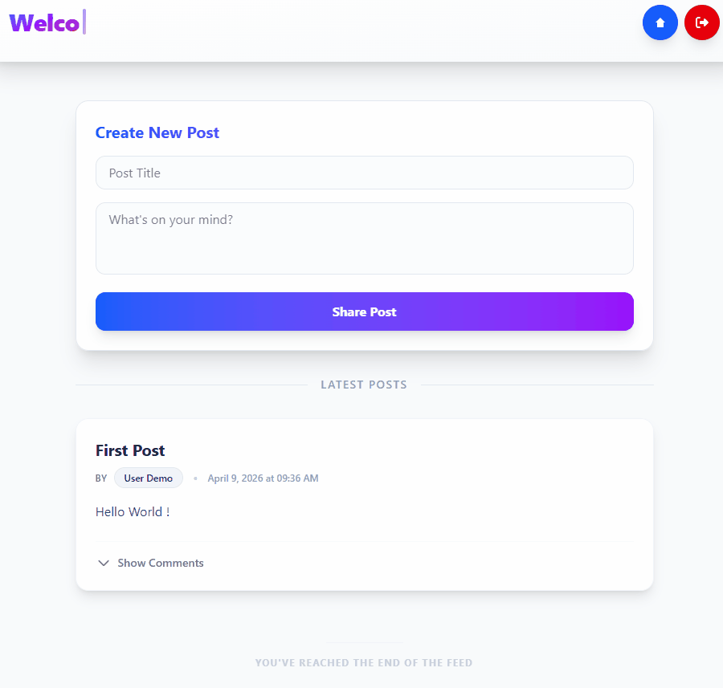

# 🚀 Full-Stack Blog Application

A modern, high-performance blog platform built with **.NET 10**, **React 19**, and **Dapper**. This application demonstrates a clean architecture, secure JWT authentication, and a rich, interactive user interface.


---

## ✨ Key Features

- **🔐 Secure Authentication**: Robust JWT-based Login and Registration with real-time validation.
- **📝 Post Management**: Full CRUD capabilities for blog posts with Vite-powered frontend performance.
- **💬 Engagement Engine**: Nested commenting system allowing for replies and deep conversations.
- **🎨 Premium UI**: Styled with Vanilla CSS (Modern design patterns) for a sleek, responsive experience.
- **⚡ High Performance**: Utilizing Dapper for lightning-fast database interactions and raw SQL control.

---

## 🎬 Visual Demos

### 🛡️ Register & Login

| Registration | Login |
| :---: | :---: |
|  |  |
| *Smooth registration flow* | *Instant JWT-powered login* |

> [!NOTE]
> **Validation Matters**: The system handles duplicate emails and field errors gracefully.
> - [Register Field Error](assets/demos/register-field-error-demo.gif)
> - [Account Exists](assets/demos/register-user-exist-demo.gif)

---

### ✍️ Post

| Creating a Post | Editing & Deleting |
| :---: | :---: |
|  |  |
| *Real-time post publishing* | *Full control over your content* |

---

### 🗣️ Comment and Reply

| Commenting | Replying |
| :---: | :---: |
|  |  |
| *Engage with authors* | *Threaded discussions* |

---

## 🛠️ Tech Stack

### Backend
- **Framework**: .NET 10.0 API
- **ORM**: Dapper (High-performance mapping)
- **Database**: SQL Server
- **Security**: JWT Bearer Authentication / BCrypt Password Hashing

### Frontend
- **Framework**: React 19 (Vite)
- **State Management**: React Hooks
- **Icons**: Lucide React
- **Styling**: Modern Vanilla CSS

---

## 🚀 Getting Started

### Prerequisites
- .NET 10 SDK
- Node.js (v20+)
- SQL Server

### 1. Database Setup
Run the SQL script located at `api/Database/myblog.sql` in your SQL Server instance to initialize the schema and tables.

### 2. Backend Configuration
Update `api/appsettings.json` with your connection string:
```json
"ConnectionStrings": {
  "DefaultConnection": "Server=YOUR_SERVER;Database=MyBlogAppDb;..."
}
```

### 3. Run the Application
```bash
# Start API (from /api)
dotnet run

# Start Frontend (from /frontend/my-blog-app)
npm install
npm run dev
```

---

## 👤 Author
**Louis Tan**

---